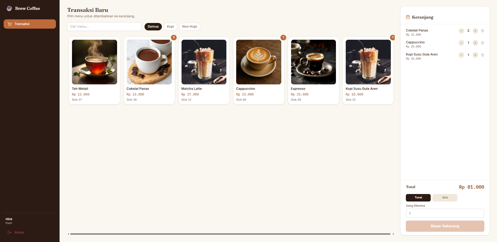
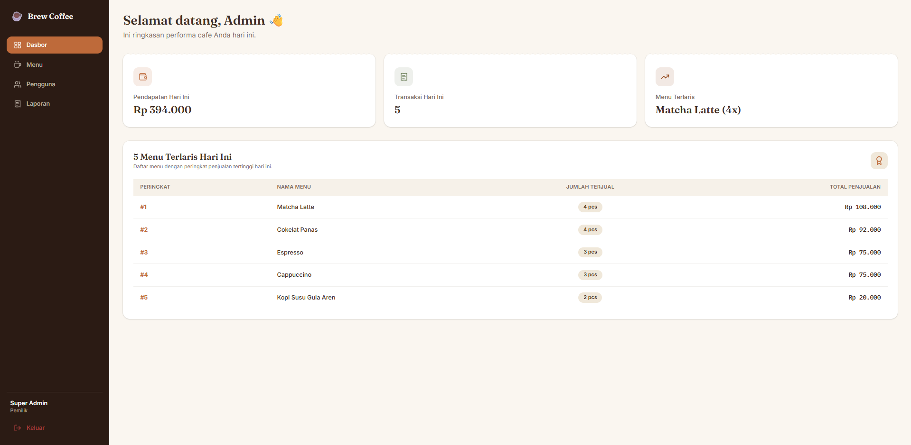
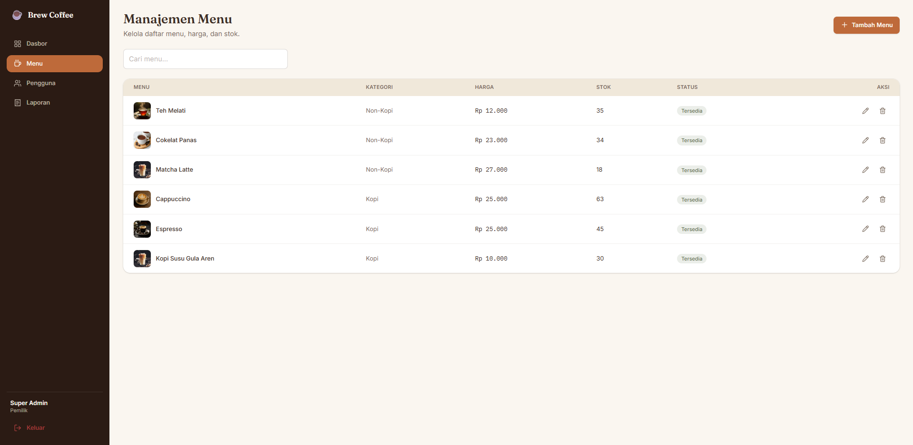
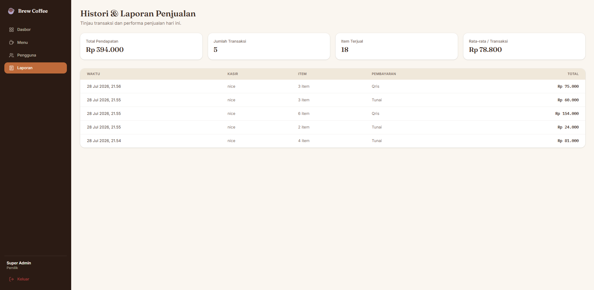

# tr-pbp-pos-web-app

Sebuah aplikasi Point of Sale (POS) full‑stack yang dikembangkan sebagai proyek portofolio untuk
menunjukkan kemampuan membangun sistem web dari sisi frontend, backend, dan integrasi database.
Saya fokus pada pengembangan antarmuka yang rapi, API yang terstruktur, serta alur transaksi yang
mudah dipahami dan diuji.

## Anggota Tim

- Aliffia Anggun Putri Rosadi — GitHub: @Aliffiaapr
- Edward J Pranyoto — GitHub: @Edward1733
- Dwi Setyawan — GitHub: @dwi-setyawan

## Ringkasan

- Tujuan: Demo sistem POS sederhana yang mendukung manajemen produk, transaksi,
  laporan, dan autentikasi pengguna.
- Cocok untuk: portofolio pengembang frontend/backend, demo teknis, dan pembelajaran.

## Fitur Utama

- Autentikasi pengguna (login/register)
- CRUD produk termasuk upload gambar
- Proses transaksi (tambah item, update jumlah, checkout)
- Laporan penjualan dan ringkasan transaksi
- Manajemen pengguna dan peran sederhana

## Teknologi

- Frontend: React, Vite
- Backend: Node.js, Express
- Database: MySQL (via Sequelize)
- Lainnya: Mulai pengaturan file upload, middleware autentikasi, dan REST API

## Demo & Screenshot






## Instalasi & Menjalankan (lokal)

1. Jalankan backend:

```bash
cd backend
npm install
npm run dev
```

2. Jalankan frontend:

```bash
cd frontend
npm install
npm run dev
```

3. Buka browser ke alamat yang ditunjukkan ( `http://localhost:5173` ).

Catatan: Pastikan MySQL / Laragon berjalan dan file konfigurasi environment di `backend/.env`
telah disesuaikan.

### Setup Database MySQL secara rinci

1. Buka Laragon, pastikan MySQL sudah aktif.
2. Masuk ke phpMyAdmin atau client MySQL Anda.
3. Buat database baru dengan nama:

```sql
CREATE DATABASE db_pos_brew;
```

4. Pastikan user database memiliki akses yang cukup. Untuk konfigurasi lokal default, biasanya:

```env
PORT=5000
DB_HOST=localhost
DB_USER=root
DB_PASSWORD=
DB_NAME=db_pos_brew
DB_PORT=3306
```

5. Jalankan backend, lalu Sequelize akan otomatis membuat tabel yang dibutuhkan.
6. Jika database tidak terhubung, cek apakah port MySQL yang dipakai adalah `3306` atau `3307`.
   Sesuaikan nilai `DB_PORT` pada file `backend/.env` jika perlu.

7. Untuk memastikan koneksi berhasil, Anda bisa cek log terminal backend. Jika muncul pesan:

```text
Database MySQL berhasil terhubung
```

maka koneksi database sudah berjalan dengan baik.

## Struktur Proyek (ringkas)

- `backend/` — server API, controller, model, routes, dan folder `uploads/` untuk gambar
- `frontend/` — kode React (komponen, halaman, layanan API)

## Endpoint Utama (contoh)

- Autentikasi: `POST /api/auth/login`, `POST /api/auth/register`
- Produk: `GET /api/products`, `POST /api/products`, `PUT /api/products/:id`, `DELETE /api/products/:id`
- Transaksi: `POST /api/transactions`, `POST /api/transactions/:id/items`, `POST /api/transactions/:id/checkout`

Untuk detail endpoint, lihat file route di `backend/routes/`.

## Pengembangan & Kontribusi

- Fork repo ini dan buat branch fitur (`feat/nama-fitur`)
- Sertakan deskripsi perubahan dan langkah menjalankan fitur di PR
